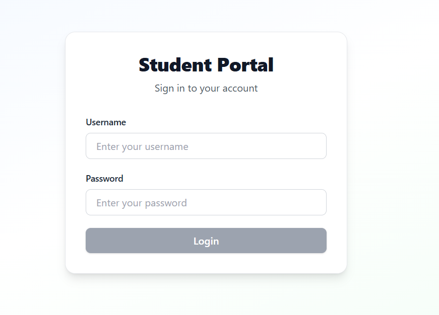
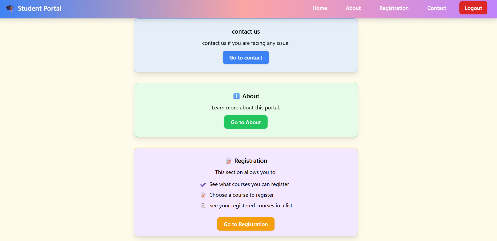
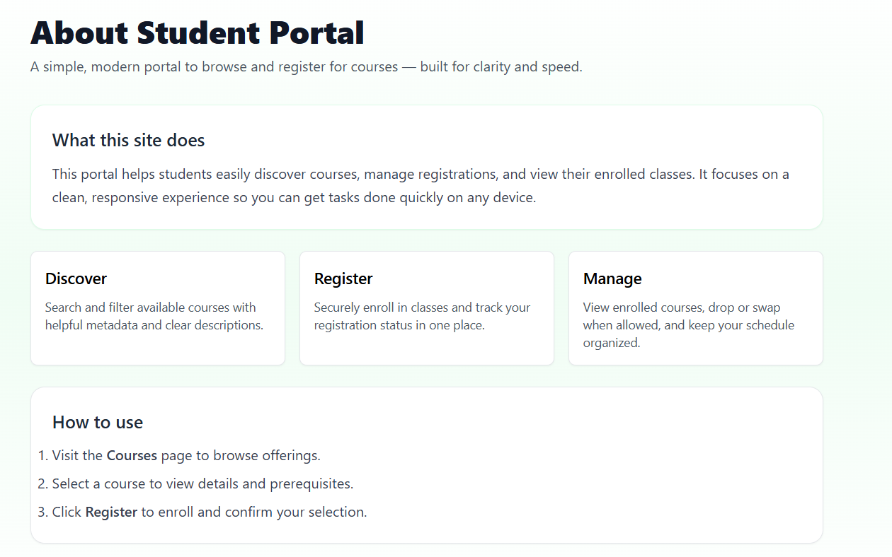
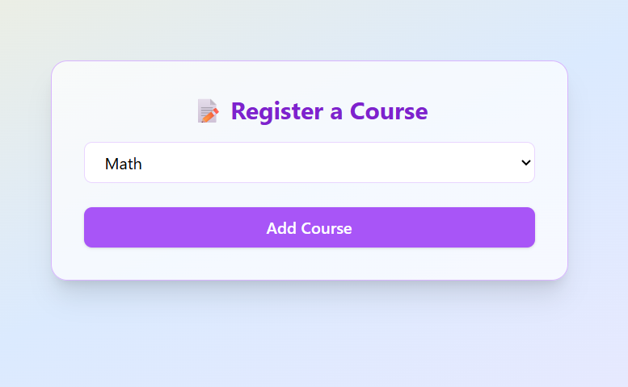
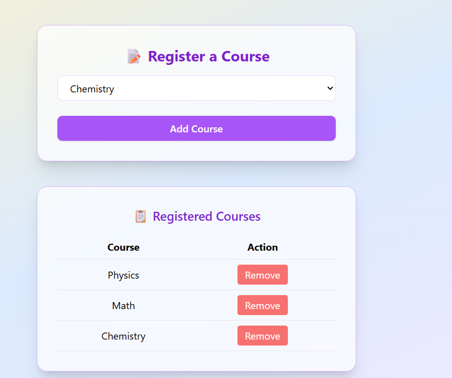
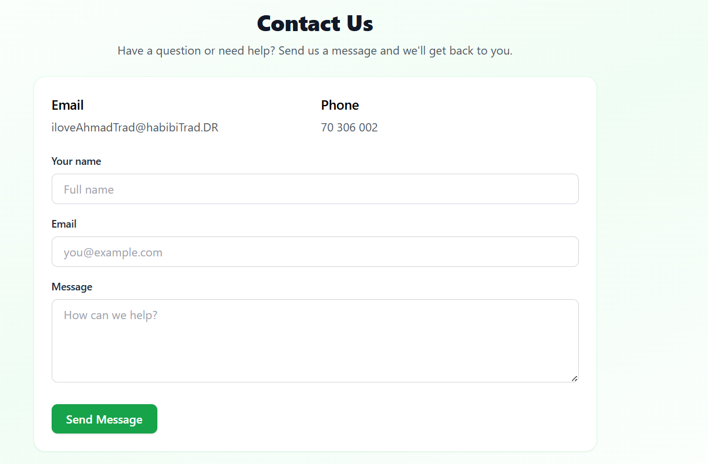

# web_project

This repository contains a small React single-page application (SPA) built with Create React App and Tailwind CSS. The app includes several UI components under `src/components` such as `Home`, `About`, `Login`, `Registration`, `ContactUs`, and a `Navbar`.

**Tech Stack:**
- **Framework:** React (v19)
- **Styling:** Tailwind CSS
- **Routing:** react-router-dom
- **Build tools:** react-scripts (Create React App)

**Project structure (important files):**
- `src/` — React source files
- `src/components/` — page and UI components (Home, Login, Registration, About, ContactUs, Navbar)
- `public/index.html` — app HTML entry
- `tailwind.config.js` — Tailwind configuration

**Components**
- `src/components/Navbar.jsx`: top navigation bar with links to pages and a logout action.
- `src/components/Home.jsx`: landing page with navigation cards to other sections (About, Contact, Registration).
- `src/components/About.jsx`: explains the portal purpose and key features.
- `src/components/Login.jsx`: login form that authenticates and redirects to the app.
- `src/components/Registration.jsx`: course selection and registration UI; shows registered courses and allows removal.
- `src/components/ContactUs.jsx`: contact form to send messages and view contact details.

**Screenshots**

**Setup & Run (local)**
Prerequisites: Node.js  and npm.

1. Clone the repo:

	`git clone <repo-url>`

2. Install dependencies:

	`npm install`

3. Start the development server:

	`npm start`

	This opens the app at `http://localhost:3000` by default.

4. Build for production:

	`npm run build`

