# web_project

This repository contains a small React single-page application (SPA) built with Create React App and Tailwind CSS. The app is a student portal with role-based authentication, featuring 12 UI components under `src/components` including `Navbar`, `Login`, `Welcome`, `Home`, `HomeAdmin`, `About`, `AboutA`, `Registration`, `ContactUs`, `AddCourse`, `AddStudent`, and `Reports`.

**Tech Stack:**
- **Framework:** React (v19)
- **Styling:** Tailwind CSS
- **Routing:** react-router-dom
- **HTTP Client:** axios
- **Notifications:** react-toastify
- **Build tools:** react-scripts (Create React App)
- **Testing:** @testing-library/react, @testing-library/jest-dom

**Key Features:**
- **Role-based Authentication:** Two user roles (Student: role=1, Admin: role=2) with protected routes
- **Context API:** AuthContext for managing authentication state across components
- **API Integration:** Backend API calls for CRUD operations on students, courses, and reports
- **Toast Notifications:** Real-time feedback for user actions using react-toastify

**Project structure (important files):**
- `src/` — React source files
- `src/App.js` — main application with routing and authentication logic
- `src/components/` — page and UI components (12 components total)
- `public/index.html` — app HTML entry
- `tailwind.config.js` — Tailwind configuration
- `.env` — environment variables (REACT_APP_API_URL for backend API)

**Components**

*Shared Components:*
- `src/components/Navbar.jsx`: top navigation bar with links to pages and a logout action.
- `src/components/Login.jsx`: login form that authenticates users and sets their role (student or admin).
- `src/components/Welcome.jsx`: welcome screen displayed to authenticated users upon initial access.

*Student Role Components (role=1):*
- `src/components/Home.jsx`: student landing page with navigation cards to other sections (About, Contact, Registration).
- `src/components/About.jsx`: explains the student portal purpose and key features.
- `src/components/Registration.jsx`: course selection and registration UI; shows registered courses and allows removal.
- `src/components/ContactUs.jsx`: contact form to send messages and view contact details.

*Admin Role Components (role=2):*
- `src/components/HomeAdmin.jsx`: admin dashboard landing page with navigation cards for administrative functions.
- `src/components/AboutA.jsx`: about page for admin users with additional administrative information.
- `src/components/AddCourse.jsx`: admin interface to add, view, and manage courses in the system.
- `src/components/AddStudent.jsx`: admin interface to add, view, and manage students in the system.
- `src/components/Reports.jsx`: displays and manages student and course reports with delete functionality.

**Screenshots**
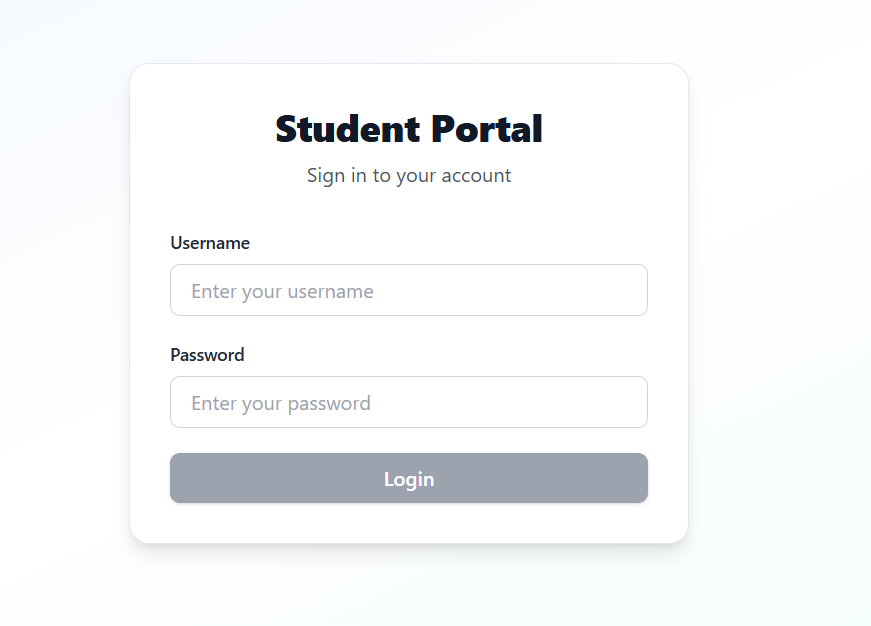
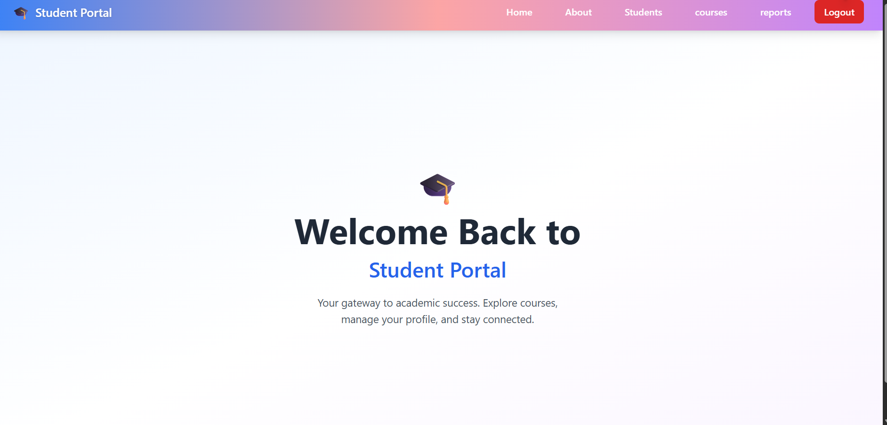
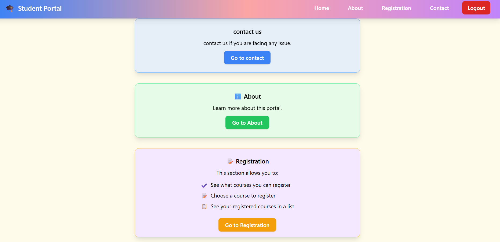
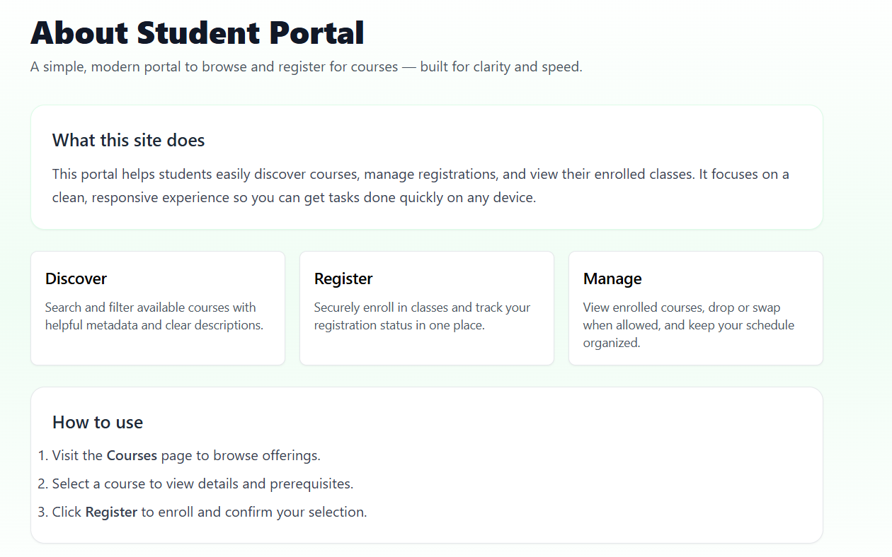
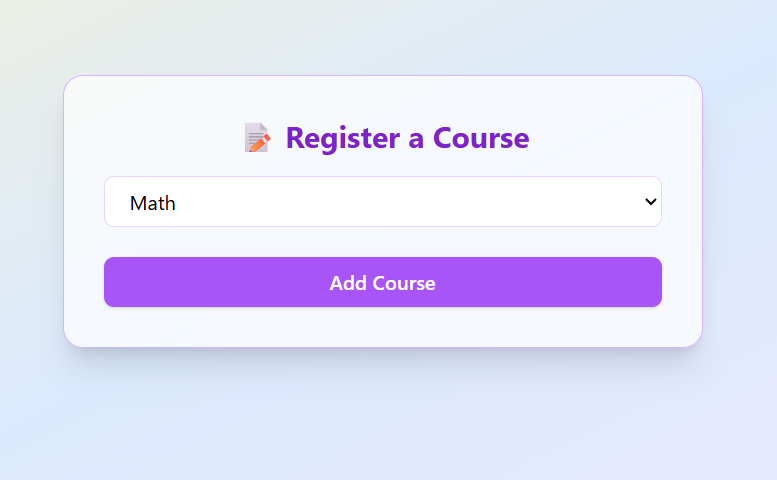
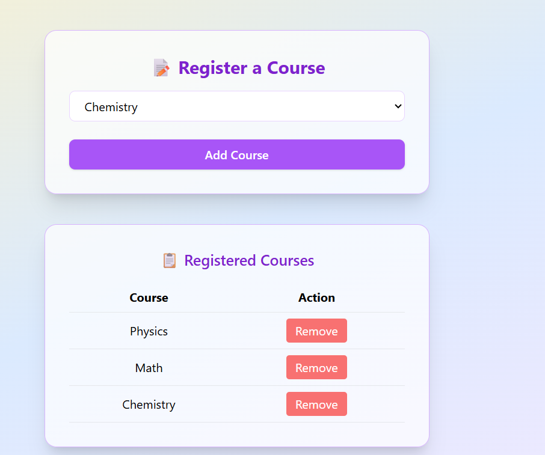
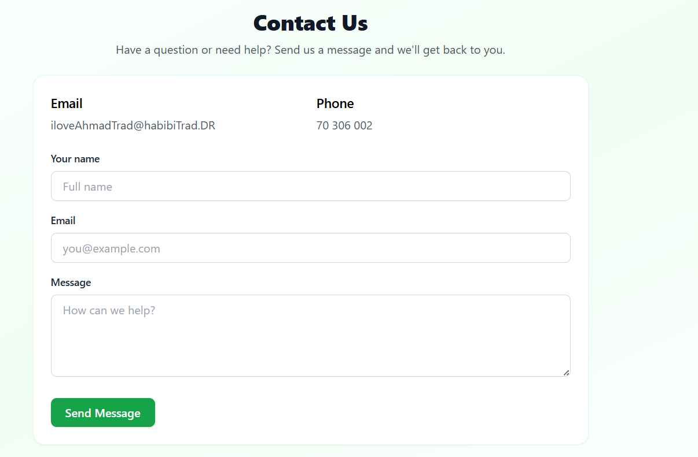
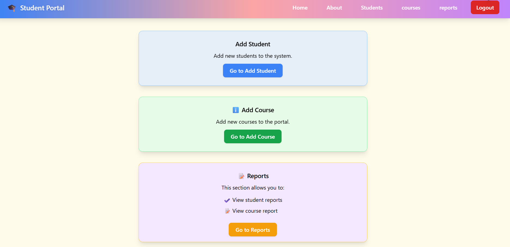
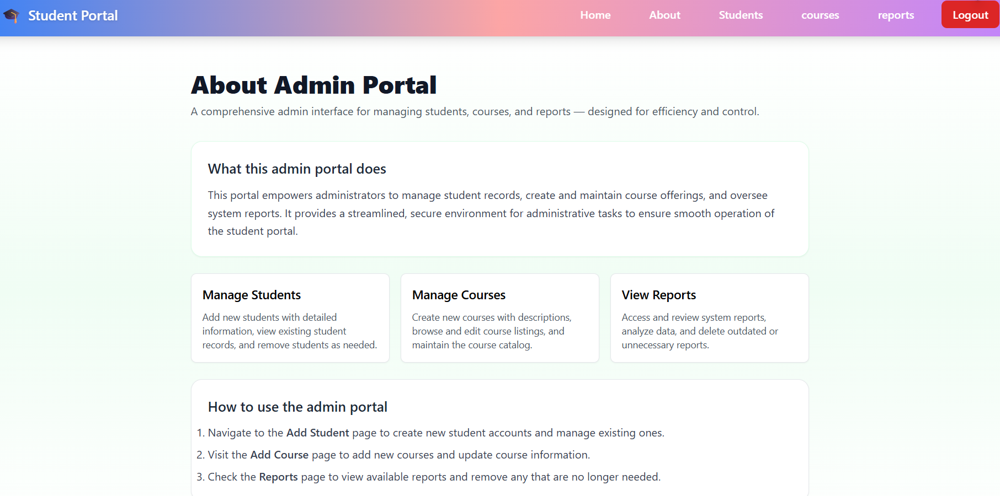
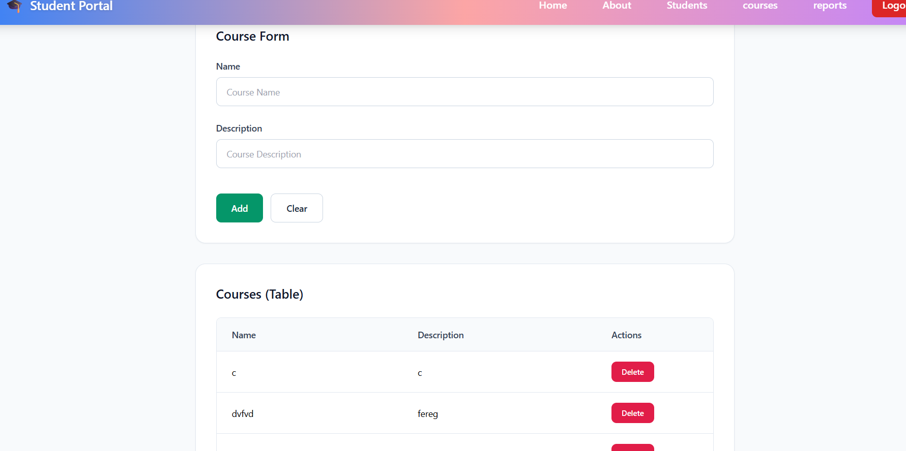
.png)
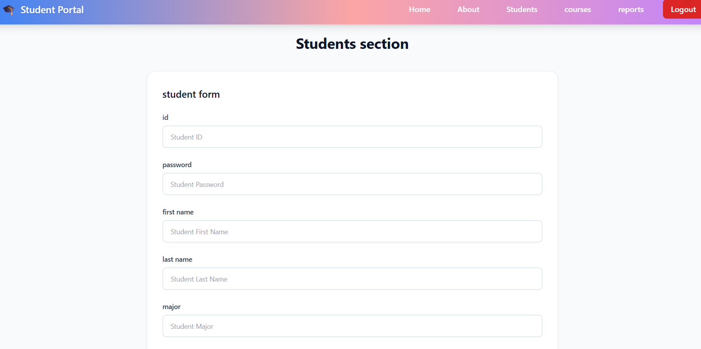
.png)
**Setup & Run (local)**
Prerequisites: Node.js and npm.

1. Clone the repo:

	`git clone <repo-url>`

2. Install dependencies:

	`npm install`

3. Configure environment variables:

	Create a `.env` file in the project root and add:
	```
	REACT_APP_API_URL=<your-backend-api-url>
	```

4. Start the development server:

	`npm start`

	This opens the app at `http://localhost:3000` by default.

5. Build for production:

	`npm run build`

6. Run tests:

	`npm test`


